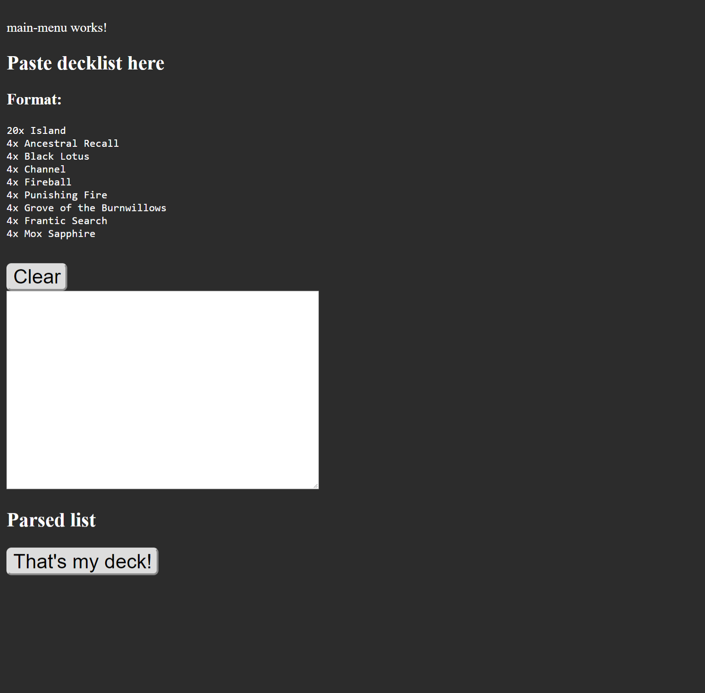
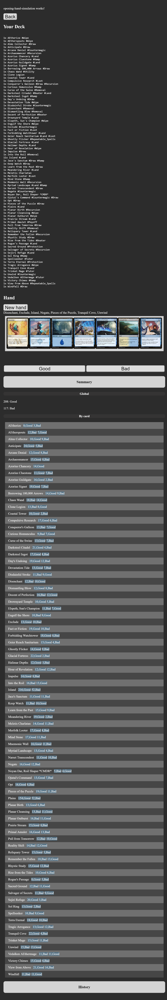

# EDH Deckbuilding Thermometer

Do you play the Commander format of  Magic: the Gathering? Are your deck to clunky? This app is for you!

Simply paste in your decklist and click 'Simulate' to get started.

## How it works

This application simulates drawing opening hands and you mark each one as good or bad or other categories. Then you can view the summary of all the hands you've reviewed in order to identify common weaknesses of the your hands.

## How to use it

You will be presented with an opening hand of 7 or 8 cards (configurable for 1v1 or multiplayer). Select either 'Keep' or another button indicating the flaw(s) in that hand. Click 'Next' to be presented with the next hand. At any time you can switch to the summary of all reviewed hands in order to identify areas of your deck that need tuning.

# Screenshots

## Deck Editor

## Simulation in progress

# EdhDeckbuildingThermometer

This project was generated with [Angular CLI](https://github.com/angular/angular-cli) version 6.2.1.

## Development server

Run `ng serve` for a dev server. Navigate to `http://localhost:4200/`. The app will automatically reload if you change any of the source files.

## Code scaffolding

Run `ng generate component component-name` to generate a new component. You can also use `ng generate directive|pipe|service|class|guard|interface|enum|module`.

## Build

Run `ng build` to build the project. The build artifacts will be stored in the `dist/` directory. Use the `--prod` flag for a production build.

## Running unit tests

Run `ng test` to execute the unit tests via [Karma](https://karma-runner.github.io).

## Running end-to-end tests

Run `ng e2e` to execute the end-to-end tests via [Protractor](http://www.protractortest.org/).

## Further help

To get more help on the Angular CLI use `ng help` or go check out the [Angular CLI README](https://github.com/angular/angular-cli/blob/master/README.md).
